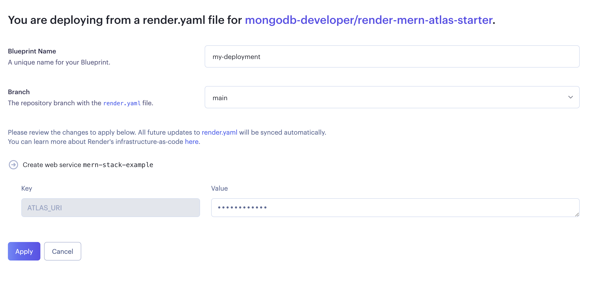

# render-mern-atlas-starter

Using Mern Stack code for the [Mern Tutorial](https://www.mongodb.com/languages/mern-stack-tutorial)

[](https://render.com/deploy?repo=https://github.com/mongodb-developer/render-mern-atlas-starter)

[](https://github.com/mongodb-developer/mern-stack-example/actions/workflows/main.yaml)

## The render yaml

The render.yaml file is building a small mern application on the "free" tier on [Render.com](https://render.com) 

```yaml
services:
  - type: web
    name: mern-stack-example
    env: node
    plan: free
    buildCommand: cd mern/client && npm install && npm run build && mv dist ../server/public
    startCommand: cd mern/server && npm install && npm start
    envVars:
      - key: ATLAS_URI
        sync: false
        generateValue: false
    healthCheckPath: /
```

The button on the top can be used to deploy this repo into the Render.

Input your Atlas Cluster to integrate the service with [MongoDB Atlas](https://www.mongodb.com/docs/atlas/getting-started/).



## The project

Local version of the code can be found here:
- https://github.com/mongodb-developer/mern-stack-example


## Disclaimer

Use at your own risk; not a supported MongoDB product
